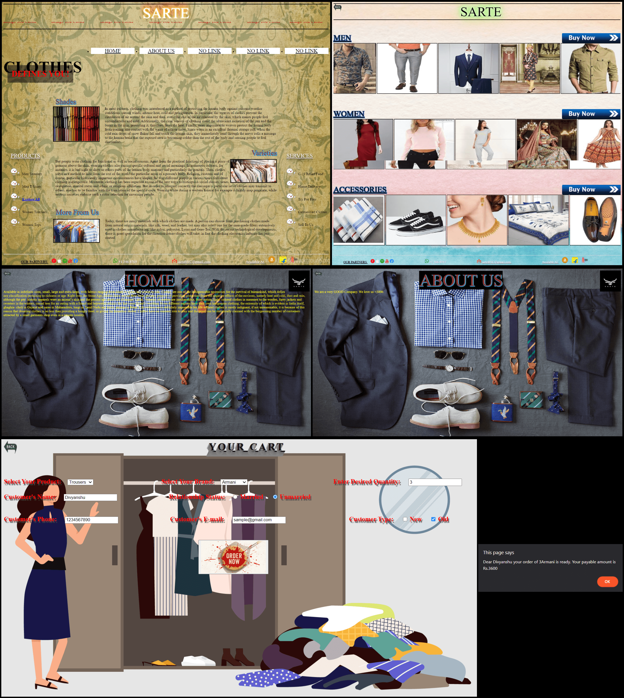

<h1>Online Cloth Store</h1>

- <b>Just clone the repo and open <code>index.html</code> in your browser.</b>
- <b>Made using only HTML, CSS and JavaScript.</b>
- <b>This is only a front-end project, it doesn't include any back-end.</b>

This is a project that I made while learning HTML, CSS and JavaScript. It includes many pages that are linked together.

On the landing page, you can find a link in the left navigation bar <code>Explore All</code> that will take you to the catalogue page. There you can find link to Men Women and Accessories section.

After choosing your desired section you'll see a "cart" next. Choose your products, fill the details and happy shopping.

<h3>Output</h3>

